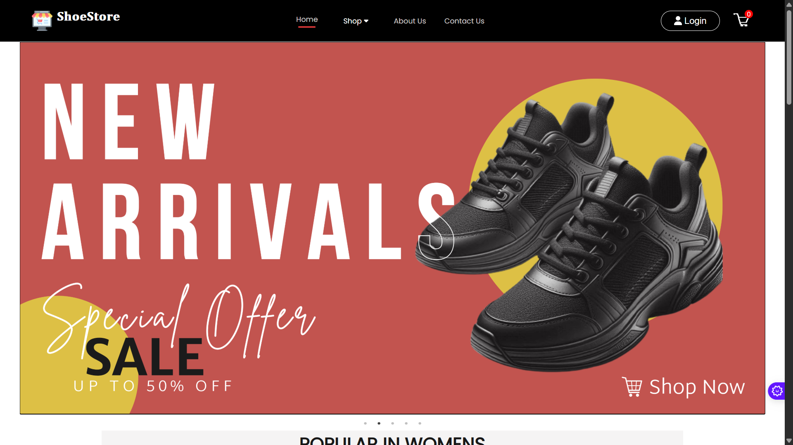
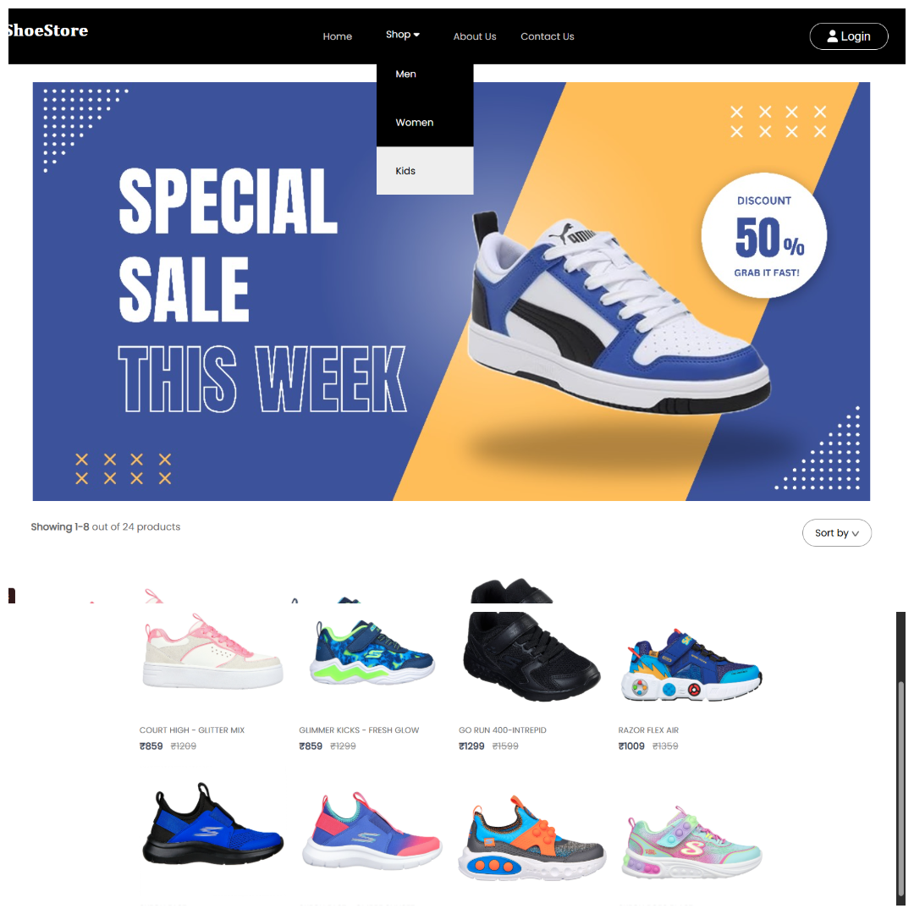
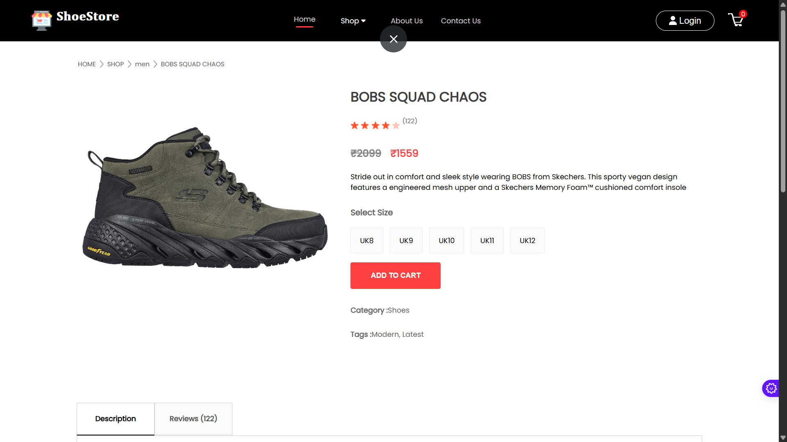
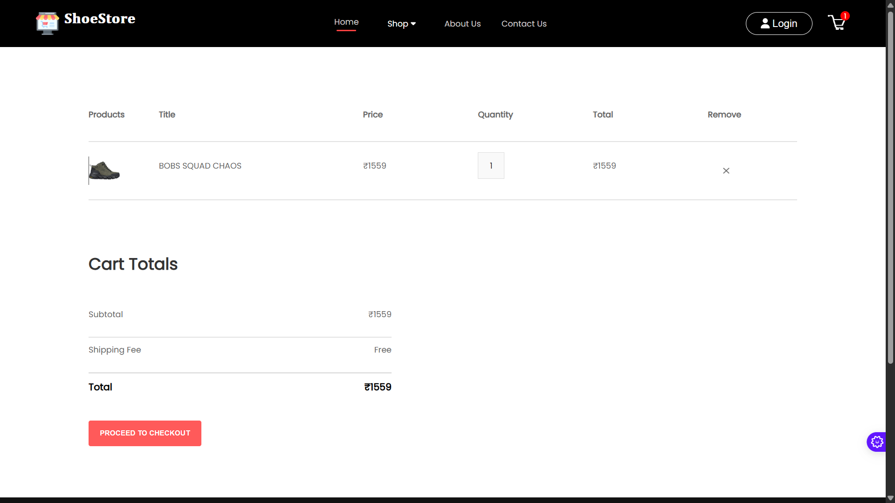
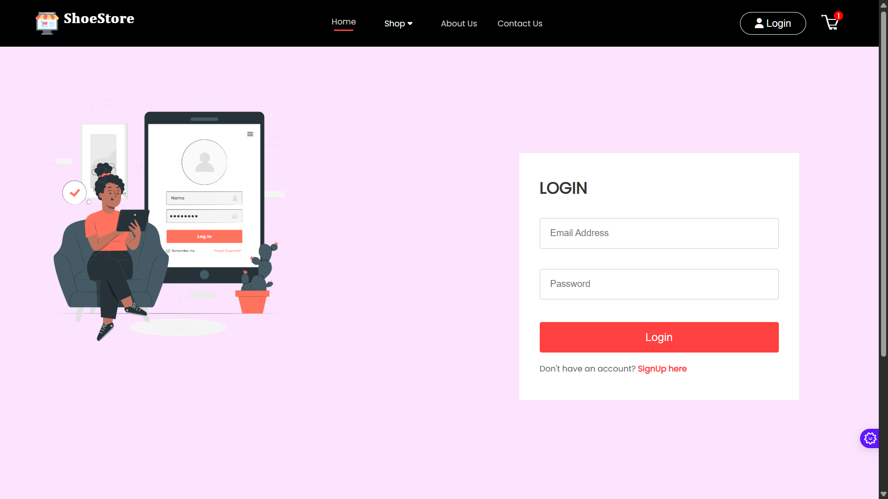
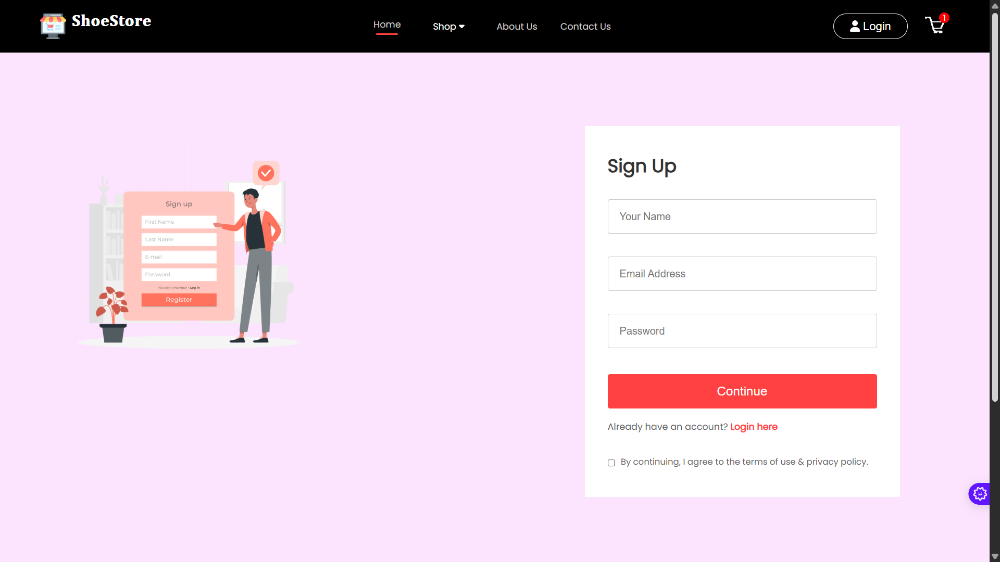
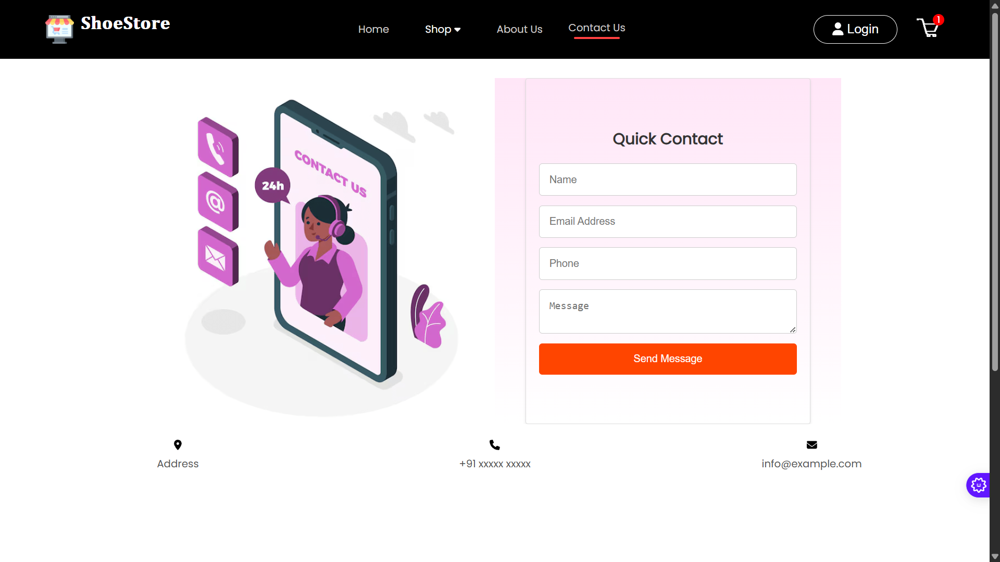
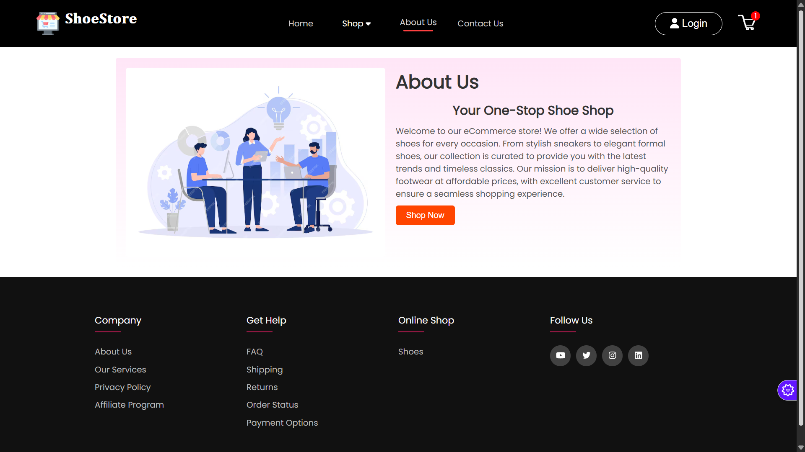

# 👟 Shoes E-Commerce Website

A modern, responsive e-commerce frontend application for footwear shopping built with React. This project provides a complete shopping experience with product browsing, cart management, user authentication, and checkout functionality.



## 📋 Table of Contents

- [Features](#features)
- [Screenshots](#screenshots)
- [Technologies Used](#technologies-used)
- [Project Structure](#project-structure)
- [Installation](#installation)
- [Usage](#usage)
- [Pages Overview](#pages-overview)
- [Components](#components)
- [State Management](#state-management)
- [Future Enhancements](#future-enhancements)

## ✨ Features

### 🛍️ Shopping Experience
- **Product Categories**: Browse shoes by Men, Women, and Kids categories
- **Product Display**: Detailed product pages with images, prices, and descriptions
- **Related Products**: View similar products on each product page
- **Popular Products**: Showcase trending and popular items
- **New Collections**: Display latest arrivals
- **Special Offers**: Highlight promotional deals

### 🛒 Cart Management
- **Add to Cart**: Seamlessly add products to shopping cart
- **Remove from Cart**: Remove unwanted items
- **Cart Counter**: Real-time cart item count in navbar
- **Total Calculation**: Automatic price calculation
- **Persistent Cart**: Cart state maintained using Context API

### 👤 User Features
- **User Registration**: Sign up with new account
- **User Login**: Secure login functionality
- **Authentication Pages**: Dedicated login and signup interfaces

### 🎨 UI/UX Features
- **Responsive Design**: Mobile-friendly layout
- **Image Slider**: Dynamic hero slider on homepage
- **Breadcrumbs**: Easy navigation tracking
- **Newsletter Subscription**: Email subscription for updates
- **Contact Form**: Customer support contact interface
- **About Us Page**: Company information
- **Footer**: Comprehensive footer with links and information

### 📦 Checkout Process
- **Shipping Form**: Collect delivery information
- **Thank You Page**: Order confirmation page
- **Error Handling**: Custom error page for better UX

## 📸 Screenshots

### Home Page

*Homepage featuring hero slider, popular products, offers, and new collections*

### Product Categories

*Men's shoes category with filtering options*


*Women's shoes category page*


*Kids shoes category page*

### Product Details

*Detailed product view with description and related products*

### Shopping Cart

*Shopping cart with item management and total calculation*

### Authentication

*User login interface*


*User registration form*

### Additional Pages

*Contact form for customer inquiries*


*About us page with company information*


*Shipping details form during checkout*


*Order confirmation page*

## 🛠️ Technologies Used

### Core Technologies
- **React** (v18.2.0) - Frontend library
- **React Router DOM** (v6.25.1) - Navigation and routing
- **React Context API** - State management

### UI Libraries
- **React Slick** (v0.30.2) - Carousel/slider component
- **Slick Carousel** (v1.8.1) - Carousel styling
- **FontAwesome** - Icons library
  - @fortawesome/fontawesome-svg-core
  - @fortawesome/free-solid-svg-icons
  - @fortawesome/free-brands-svg-icons
  - @fortawesome/react-fontawesome

### HTTP Client
- **Axios** (v1.7.7) - API requests

### Development Tools
- **Create React App** - Project setup and build tools
- **React Scripts** (v5.0.1) - Build configuration

## 📁 Project Structure

```
ShoesWebsite/
├── public/
│   ├── index.html
│   ├── favicon.ico
│   └── manifest.json
├── src/
│   ├── Components/
│   │   ├── AboutUs/          # About us section
│   │   ├── Assets/           # Images and static files
│   │   ├── Breadcrums/       # Navigation breadcrumbs
│   │   ├── CartItems/        # Cart items display
│   │   ├── ContactForm/      # Contact form component
│   │   ├── DescriptionBox/   # Product description
│   │   ├── Footer/           # Footer component
│   │   ├── Hero/             # Hero section
│   │   ├── Item/             # Product item card
│   │   ├── Navbar/           # Navigation bar
│   │   ├── NewCollections/   # New arrivals section
│   │   ├── NewsLetter/       # Newsletter subscription
│   │   ├── Offers/           # Special offers section
│   │   ├── Popular/          # Popular products section
│   │   ├── ProductDisplay/   # Product detail display
│   │   ├── RelatedProducts/  # Related items section
│   │   └── Slider/           # Image slider
│   ├── Context/
│   │   └── ShopContext.jsx   # Global state management
│   ├── Extra_pages/
│   │   ├── Errorpage/        # 404 error page
│   │   ├── Shippingpage/     # Shipping form
│   │   └── Thankyoupage/     # Order confirmation
│   ├── Pages/
│   │   ├── Cart.jsx          # Shopping cart page
│   │   ├── Home.jsx          # Homepage
│   │   ├── Login.jsx         # Login page
│   │   ├── Product.jsx       # Product detail page
│   │   ├── ShopCategory.jsx  # Category page
│   │   └── Signup.jsx        # Registration page
│   ├── App.js                # Main app component
│   ├── App.css               # Global styles
│   ├── index.js              # Entry point
│   └── index.css             # Base styles
├── package.json
└── README.md
```

## 🚀 Installation

### Prerequisites
- Node.js (v14 or higher)
- npm or yarn package manager

### Steps

1. **Clone the repository**
   ```bash
   git clone https://github.com/yourusername/shoes-ecommerce-frontend.git
   cd shoes-ecommerce-frontend
   ```

2. **Install dependencies**
   ```bash
   npm install
   ```
   or
   ```bash
   yarn install
   ```

3. **Start the development server**
   ```bash
   npm start
   ```
   or
   ```bash
   yarn start
   ```

4. **Open your browser**
   Navigate to [http://localhost:3000](http://localhost:3000)

## 💻 Usage

### Running the Application

```bash
# Development mode
npm start

# Build for production
npm run build

# Run tests
npm test
```

### Environment Setup

If you need to connect to a backend API, create a `.env` file in the root directory:

```env
REACT_APP_API_URL=your_api_url_here
```

## 📄 Pages Overview

### 1. **Home Page** (`/`)
- Hero slider with promotional banners
- Popular products section
- Special offers display
- New collections showcase
- Newsletter subscription

### 2. **Category Pages** (`/mens`, `/womens`, `/kids`)
- Category-specific banner
- Filtered product grid
- Product cards with images and prices
- Quick add to cart functionality

### 3. **Product Detail Page** (`/product/:productId`)
- Large product images
- Product information (name, price, description)
- Size selection
- Add to cart button
- Product description box
- Related products section

### 4. **Shopping Cart** (`/cart`)
- List of cart items with images
- Quantity adjustment controls
- Remove item option
- Subtotal calculation
- Proceed to checkout button

### 5. **Authentication Pages**
- **Login** (`/login`) - User login form
- **Signup** (`/signup`) - New user registration

### 6. **Additional Pages**
- **About Us** (`/aboutus`) - Company information
- **Contact** (`/contactform`) - Contact form
- **Shipping** (`/shippingpage`) - Delivery details form
- **Thank You** (`/thankyoupage`) - Order confirmation
- **Error** (`/errorpage`) - 404 page

## 🧩 Components

### Core Components

#### Navbar
- Logo and branding
- Navigation links (Home, Men, Women, Kids, About, Contact)
- Shopping cart icon with item count
- User authentication links

#### Footer
- Company information
- Quick links
- Social media icons
- Copyright information

#### Product Item Card
- Product image
- Product name
- Price display (old price & new price)
- Hover effects

#### Slider/Carousel
- Auto-playing image slider
- Navigation dots
- Responsive design

### Feature Components

#### Cart Items
- Product thumbnail
- Product details
- Quantity controls (+/-)
- Remove button
- Price calculation

#### Product Display
- Image gallery
- Product information
- Size selector
- Add to cart functionality
- Breadcrumb navigation

#### Newsletter
- Email input field
- Subscribe button
- Promotional text

## 🔄 State Management

### Context API Implementation

The application uses React Context API for global state management through `ShopContext`:

#### Features:
- **Cart State**: Maintains cart items and quantities
- **Add to Cart**: Function to add products
- **Remove from Cart**: Function to remove products
- **Total Calculation**: Calculate cart total amount
- **Item Count**: Track total items in cart
- **Product Data**: Access to all products

#### Usage Example:
```javascript
import { useContext } from 'react';
import { ShopContext } from './Context/ShopContext';

const { addToCart, cartItems, getTotalCartAmount } = useContext(ShopContext);
```

## 🎯 Key Functionalities

### 1. **Product Browsing**
- Users can browse products by categories
- View product details with images and descriptions
- See related products for cross-selling

### 2. **Shopping Cart**
- Add multiple products to cart
- Adjust quantities
- Remove unwanted items
- View real-time total calculation
- Cart badge shows item count

### 3. **User Authentication**
- Register new account with signup form
- Login with existing credentials
- Protected routes (if implemented with backend)

### 4. **Checkout Flow**
- Review cart items
- Fill shipping information
- Order confirmation page

### 5. **Responsive Design**
- Mobile-friendly interface
- Tablet optimization
- Desktop layout

## 🔮 Future Enhancements

### Planned Features
- [ ] Backend integration with REST API
- [ ] User profile and order history
- [ ] Product search functionality
- [ ] Advanced filtering (price, size, color)
- [ ] Product reviews and ratings
- [ ] Wishlist functionality
- [ ] Payment gateway integration
- [ ] Order tracking
- [ ] Admin dashboard
- [ ] Real-time inventory management
- [ ] Social media login
- [ ] Multi-language support
- [ ] Dark mode theme

### Technical Improvements
- [ ] Redux for advanced state management
- [ ] TypeScript migration
- [ ] Unit and integration tests
- [ ] Performance optimization
- [ ] SEO optimization
- [ ] Progressive Web App (PWA)
- [ ] Lazy loading for images
- [ ] Code splitting

## 📝 Notes

- This is the **frontend only** - backend API integration required for full functionality
- Product data is currently stored locally in the Assets folder
- Authentication is UI-only without actual backend validation
- Cart data is stored in React state (not persisted on refresh)

## 🤝 Contributing

Contributions are welcome! Please feel free to submit a Pull Request.

1. Fork the project
2. Create your feature branch (`git checkout -b feature/AmazingFeature`)
3. Commit your changes (`git commit -m 'Add some AmazingFeature'`)
4. Push to the branch (`git push origin feature/AmazingFeature`)
5. Open a Pull Request

## 📧 Contact

Your Name - [Your Email]

Project Link: [https://github.com/yourusername/shoes-ecommerce-frontend](https://github.com/yourusername/shoes-ecommerce-frontend)

## 📜 License

This project is open source and available under the [MIT License](LICENSE).

---

**Made with ❤️ using React**
